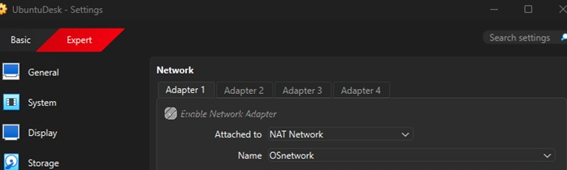
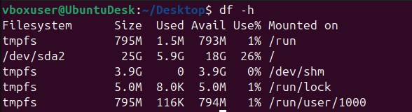
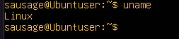
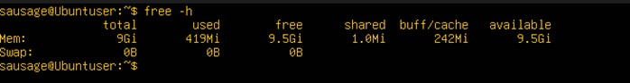
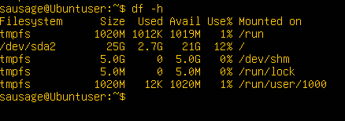

# CMPN202 Operating Systems Coursework: Week 1 Documentation

## Operating System Used

The following operating systems were selected for deployment in this report:
* **Server:** Ubuntu Server 24.04.3 TLS
* **Workstation:** Ubuntu 24.04.3 Desktop

## Introduction

This document outlines the planning and justification for a virtual operating system deployment. The main objective is to select and deploy two operating systems in a networked environment, which will act as a foundation for Phase 2 and Phase 3. This report details the system architecture, the justification for the selected OS for the server and workstation, as well as the virtual network connection.

---

## System Architecture Design 

**NAT Network**
Both OS are under the NAT network and can freely communicate ( intervm-communication ). 
## Distribution Selection Justification: Server

**Selected Distribution:** Ubuntu Server 24.04.3 TLS

The server is the backbone of this project, and stability, reliability, and system updates are very important considerations for choosing this operating system.

### Primary Justification

* **Stability:** It is based on Debian Linux and has a reputation for being one of the most stable and secure operating systems available. The Long-Term Support (LTS) releases of Ubuntu Server receive standard security updates for around 2,500 packages for five years by default.
* **Security:** Each LTS release comes with five years of free standard security maintenance from Canonical. Ubuntu also includes key security mechanisms like **AppArmor**, **Uncomplicated Firewall (UFW)**, and **Hardened Default Configuration** (by default no port is open, root login is locked).
* **Performance:** Ubuntu ships with a modern version of the Linux kernel which provides a significant performance advantage. It comes without a GUI, which keeps the system lean as there will be minimal usage of RAM and CPU. It is also highly optimized, making this OS a leading platform for Docker and Kubernetes.
* **Simplicity and Streamlined Connectivity:** Ubuntu Desktop and Ubuntu Server share the same underlying architecture and command-line interface, meaning the same commands can be used across both systems, making management more efficient.

### Comparison with Other Alternatives for Server OS

| Ubuntu Server | CentOS | Fedora OS | Windows Server |
| :--- | :--- | :--- | :--- |
| Free, Debian open-source distribution. Publisher: Canonical Ltd. | Free, open-source distribution. Publisher: Red Hat (RHEL) | Free and open source. Publisher: Red Hat/Fedora project | Expensive licensing fees and Closed-source. Publisher: Microsoft corporation. |
| Rolling-release, LTS version release, meaning no major updates but few security patches updates | 13 months support life, meaning continuous updated with new features | Release frequency is between 2-3 years for system-wide updates every year | Release frequency is between 2-3 years for example Windows Server 2016, 2019, 2022, and 2025 |
| Easy to use and widely considered the friendliest Linux server. | Not as simple as Ubuntu as it is intended for developers. | Aimed for developers and experts who are comfortable with frequent changes and troubleshooting. | Offers GUI for simple tasks but can be complex for automation and scripting. |
| Security model is based on **AppArmor**, which is simple and user-friendly. | The security is based on **SELinux**, extremely powerful but often known for its complexity. | It also relies on **SELinux** for security. | Proprietary. A closed-source model that relies on a different security paradigm. |
| Package management is managed by **APT (.deb)** which is the largest software repositories in the world. | **DNF/YUM(.rpm)** is used for package management. | **DNF/YUM(.rpm)** is used for package management. | Fragmented, relies on a mix of GUI installers, PowerShell and other third party tools. |

---

## Distribution Selection Justification: Workstation

**Selected Distribution:** Ubuntu Desktop

Ubuntu Desktop is one of the most popular and user-friendly open-source operating systems. It is widely used within the development community and benefits from strong, community-driven support.

### Primary Justification

1. **Accessibility and User friendly:** Ubuntu is very user friendly, its installer is simple, and its default GNOME desktop environment is clean, modern, and intuitive. It is also lightweight and does not come pre-installed with unnecessary software.
2. **Stability and Reliability (LTS):** Ubuntu comes with **Long-Term Support (LTS)** which guarantees five years of free security and maintenance updates. This is a perfect choice for a stable, reliable system that does not require constant, major updates.
3. **Large Community Support:** Ubuntu has a very large and active developer community with extensive documentation. Solutions to problems are likely already posted in forums like GitHub or Stack Overflow.
4. **Security:** For general-purpose desktop systems, Ubuntu is the most secure mainstream operating system. It has a robust permission and user privilege system (the root account is locked by default). It also offers **AppArmor**, **UFW**, automatic security updates, and Disk encryption.

### Comparison with Other Alternatives

| Ubuntu | Windows 11 | macOS | Fedora Workstation |
| :--- | :--- | :--- | :--- |
| Free for all. Uses GNOME (customised). | Not completely free; requires licensing. Fluent UI (start Menu). | Works only on dedicated hardware provided by Apple. Aqua (Dock and Menu bar). | Free and open-source. GNOME (Stock/Latest). |
| Full and total customisation is possible. | Customisation is very limited. | Very low customisation options. | Highly customisable. |
| Support cycle is excellent (5 year LTS). | Long term support. | Support is tied to hardware. | Very short support of 13 months. |

---

## Network Configuration

**Network used:** NAT network named `OSnetwork`. Both OS are isolated and can communicate with each other.

### VirtualBox Settings

The Workstation system network adapter is configured to be attached to the `NAT Network` named `OSnetwork`.

### IP Addressing and Network Information

#### Server Host IP Address

* **Server Host IP address:** `192.168.10.4 /24`

#### Workstation IP Address

* **IP address:** `192.168.10.3 /24`

### Ping Tests

**From Server to Workstation:**

**From Workstation to Server:**

---

## System Documentation Using CLI

### Workstation

**Uname**

This gives us the information about the machine and the operating system kernel which in this case is Linux.

**Free**

This command gives us the information about memory usage – including RAM and swap space which in this case is shown below:

> **Note:** More human readable output can be generated by adding `-h` (e.g., `free -h`).

From the screenshot above we can see that the total RAM allocated is **8131028 KB** which is roughly equivalent to **8 GB**. Around **1 GB** of RAM is currently being used, and **6 GB** RAM is not being used now. We can also notice that **35444 KB** of memory is used for shared memory which is used for inter-process communication.

**Df -h**

This command is used for displaying disk space usage for all mounted filesystems on the system which is also given below:

From the given diagram we can see that the main partition (`/dev/sda2`) is sized at **25 GB** and **5.9 GB** is used.
We can also notice temporary file systems (`tmpfs`) being used on `/run`, `/dev/shm`, `/run/lock` and `/run/user/1000`. All of these are standard, temporary locations (RAM) that the OS use for storing run time data, shared memory, and lock files, all of which are safe to be deleted upon reboot.

**Lsb_release**

`lsb_release` command is used to display the information about the Linux distribution that we are running.

We can see that the operating system name is Ubuntu and the specific version that we are running is **Ubuntu 24.04.3 LTS**, the development codename is **noble** and the base release number is **24.04**.

### Server

**Uname**

The server kernel is Linux.

**Free -h**

From the picture above, we can clearly see that the total amount of RAM is **9.6 GB**, currently used RAM **419 MB**, Free **9.5 GB**.

**Df -h**

We can observe the following:
1. The main drive (`/dev/sda2`) is **25GB** in total among which **2.7GB** has already been used which leaves us **21GB** available to use.
2. Temporary file system is **1020MB**, **5.0 GB** and **1020 MB** respectively among which only **1012KB** and **12KB** has been used.

**Lsb_release**

We can observe the following:
1. The distributor is Ubuntu and the version we are currently running is **Ubuntu 24.04.3 LTS**.
2. Development codename is **noble**.
3. Base release number is **24.04**.
