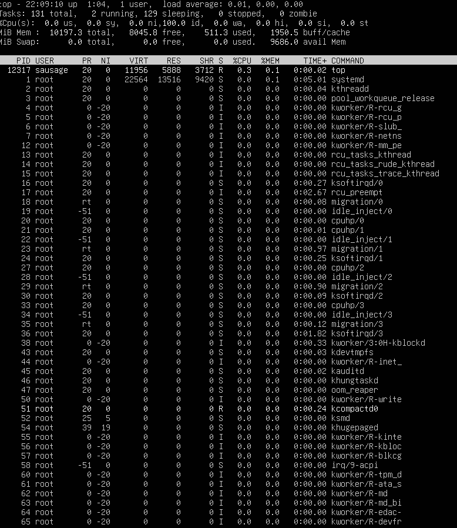
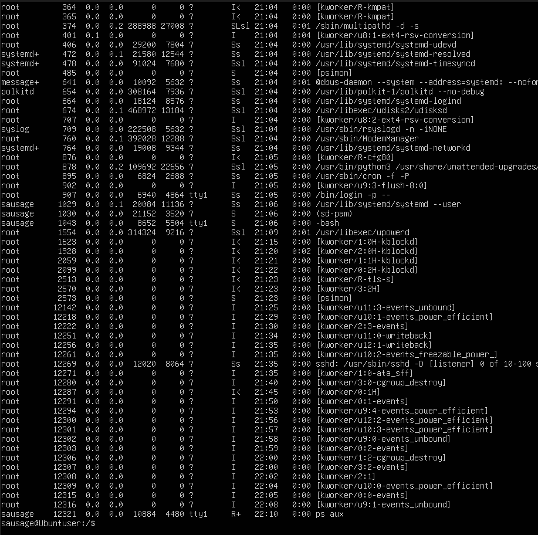
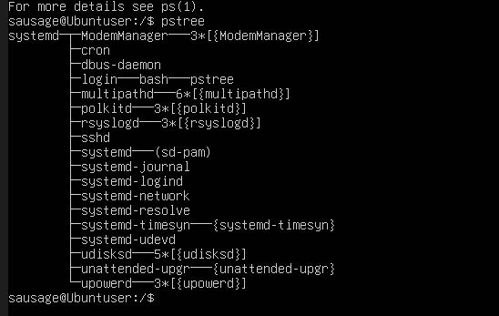

## Assessment Week 2 : Security Plannning and Testing Methodology

# 1. Performance Testing Plan
### **Objective : ** To design a methodology for monitoring system resources and stress-testing process management controls.

## Remote Monitoring Methodology

I have implemented an agentless monitoring approach. Instead of installing heavy GUI applications on the server, I utilized standard CLI tools accessed remotely via SSH.

## Tools Used
### top 
 interactive process viewer for linux, which shows real-time system resource usage (CPU, RAM, tasks, Load etc.)

### Usage Syntax

**top** This displays CPU memory Usage and other system information

**P** Inside top, when pressed 'P' will display and sort processes by CPU usage.

**M** Similar to 'P', 'M' will display Memory usage

Note : You can use the htop/btop tool for more interactive version of top.

### ps aux 
 displays snapshot of all running processes with detailed information 

 ### Usages Syntax

 **ps aux** shows all process 
 **ps aux --sort=-%mem**  sort by memory usage '-' shows order in descending order
 **ps aux --sort=-%cpu** sort by CPU usage.
 **ps -u username** shows process from a specific user.
 **ps -p <pid>** Extract process by process id.
 **pstree -p** show tree view or hierarchy (pstree)

### nmon
Advanced system monitoring tool with export feature for data anaysis.

### Usage Syntax

**nmon [options]**

### Options

**-o <file>**  specify output file
**-t** top processes
**-a** capture all stats
**-D** Disk stats
**-N** Network stats
**-C** CPU stats
**-M** Memory Stats
 ## Testing Approach

 To validate the effectiveness of process management controls, I followed a structured testing lifecycle.

 ## 1. Idle state

This is the idle resource consumption by server.

### Idle state using top 

### Idle state using htop

### PS tree

### btop

**Installation**
sudo apt install btop

**System idle state from Btop**

### nmon

**Installation**
sudo apt install nmon

**nmon menu page**  nmon -a

**nomon view with CPU, Memory and network status**

## Testing Approach

For testing I have decided to use tools called stress. This tool can generate load on the system which we can monitor using the tools already described above. Stress tool can be installed using the command sudo apt install stress

Note : for powerful stress tool we can use stress-ng

## TOOLS for testing.

There are several tools that are available for linux system which can generate loads to test CPU, GPU and other components of the system such as RAM, DISk and so on .

Most of the tools can be installed with this command:

sudo apt install toolname.

Some of the popular tools are as follows

1. Stress : Stress is a very basic and  lightweight load generator which tests CPU, DISk and IO speed. It is very basic in nature and does not have the ability to perform detailed and heavy testing.

2. stress-ng : Stress ng is a highly configurable and powerful version of stress which can perfrom testing on more than 200 components such as DISK, VM, FILE SYSTEM and so on. It has the ability to simulate kernel level bug as well.

3. cpuburn : This tool can generate and test high thermal CPU stress (generates heat on CPU). It is used for stability testing under heavy thermal load.

4. lookbusy : Used for generating realistic CPU load ( 1% to 100%) 

5. memtester : tool for testing user-space allocated RAM . Good at detecting memory corruption.

### Using stress tool.

command given = stress --cpu 4 --timeout 60&

### Results from monitoring tools

**top**

**btop**

**nmon**

**psstree**

# Security Configuration Checklist and Testing Plan.

## Initial SHH setup.

we will generate SSH key pair in workstation and use the key for remote ssh logins instead of using passwords. This will significanlty reduce the risk of successful bruteforce login into our system.

To generate the ssh key we will use the  following command : 

**ssh-keygen -t ed25519 -C "server-key"

[imageproof server key]

we are using ed25519 because it is based on elliptic-curve cyptography and provides very strong protection even with smaller key sizes(256-bit). They are also very faster to generate, sign, verify and uses less CPU power.

Some of the features of this key are :
1. High security
2. High performance
3. safety against implementation mistakes
4. Resistance to modern cryptography attacks

**Why ed22519 over RSA**

## Security
    The security of RSA depends on the key size. A key size of 2048-bit is generally considered the minimum secure option, while 4096-bit keys are more secure. However, RSA can be considered vulnerable if padding is improperly implemented, the key size is too small, or random number generation is weak.

    Ed25519, on the other hand is based on modern elliptic-curve cryptography (curve25519). A 256-bit ed25519 is roughly equivalent in strength to a 3072-4096 bit RSA key. It is highly resistant to common attacks such as timing attacks, cache attacks, and RNG failures, and its design reduces the likelihood of implementation mistakes.

## Performance

    RSA key generation, signing and verification are comparatively slow when the key size is large. This can increase CPU usage and slow authentication on servers handling many simultaneously SSH connections.

    On the other hand, ed25519 is extremely fast in key generation, signing and verification. Its efficiency makes it ideal for modern servers, automation pipelines, and low-power devices like IoT hardware or Raspberry Pi systems. For environments requiring frequent SSH connections, Ed25519 provides a dramatic performance advantage.

## SSH hardening
 
 Hardening SSH can be done through making changes in the ssh configuration file which is often located at /etc/shh/sshd_config.

 It is really important to backup the initial ssh configuration file before making any significant changes so that we can revert back to the settings in case anything goes wrong. 
 
 Creating backup of configuration file can be achieved by : sudo cp /etc/ssh/sshd_config /etc/ssh/sshd_config.backup

Before SSH configuration:

After SSH configuration:

**changes made**
 1. PasswordAuthentication no
    By doing this change we are essentailly telling the server to not accept tunneled text password logins. This setting can significantly makes the system secure against password based bruteforce attacks.

2. PubkeyAuthentication yes
    This settings ensures that the login is possible using public/private key pairs. When we generated the key in our workstation : 

    

    we also copied the SSH public key to the server which enables us to login without a password. 

    

3. PermitRootLogin no

    This configuration disables root login over SSH.It prevents anyone from loggin in as the root user directly.It also reduces the risk of unauthorized full system access.

4. port 2424 ( changing the default port of SSH)

   Changing the default SSH port is one of the common hardening technique to reduce automated attacks.

   

    we must also configure the firewall to allow newly setup port by using this command:

    sudo ufw allow 2424/tcp
    sudo ufw reload

    

## Firewall Implementation 

**Setting up default policies**
 **commands**
 Sudo ufw default deny incoming : Blocks all incoming traffic connections.

 sudo ufw default allow outgoing : Allow outgoing traffic from the system. (Egress)

sudo ufw allow from 192.168.10.3 (workstation) to any port 22  : Allows incoming connections from a specific IP address the connection is allowded only to port 22, which is the default SSH port.

## USER and Privilege Management.

1. Creating a user
    sudo adduser adminuser
    

2. Adding user to sudo group
    

3. Verfication group membership
    

4. Testing sudo access:
    

5. Listing all users with sudo access
    

## Access Control (MAC)
